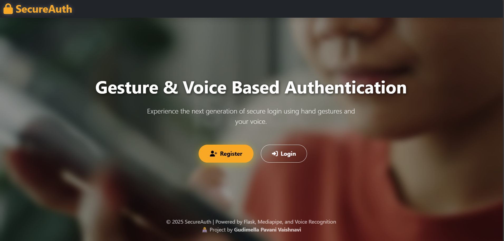
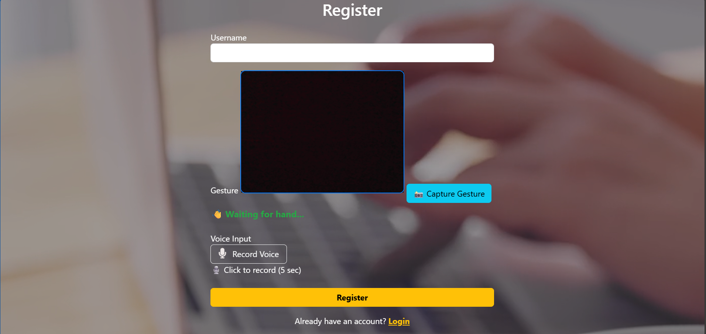
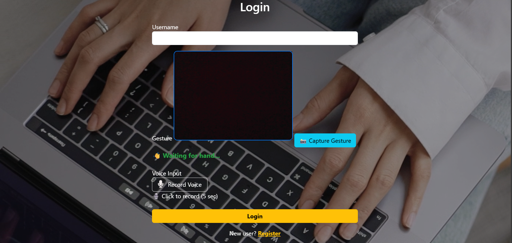
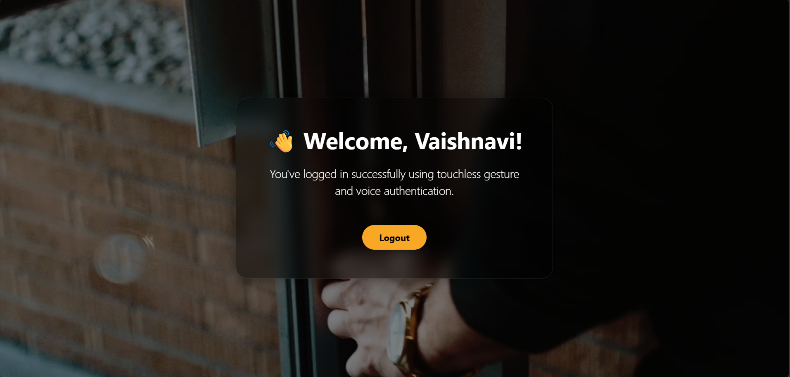

<p align="center">
  
</p>

# 🛡️ Gesture & Voice-Based Password Authentication System

> A Touchless Secure Authentication system that uses **hand gestures** and **voice recognition** for login & registration, built using Flask, Mediapipe, and SpeechBrain.

---

## 🔐 Features

- ✋ Gesture recognition using **MediaPipe** (converted to binary and verified with Hamming distance)
- 🎙️ Voice verification using **SpeechBrain speaker embedding**
- 🧠 Dual authentication: Gesture + Voice Phrase + Speaker Identity
- 📸 Real-time gesture capture via webcam
- 🎤 Voice input recording with browser mic
- 🧾 Admin Dashboard to view users
- 📦 Backend: Flask + MySQL
- 🌐 Frontend: HTML, CSS, Bootstrap, JavaScript

---

## 📸 Screenshots

| Index Page | Register Page | Login Page |
|------------|---------------|------------|
|  |  |  |

| Gesture Mismatch | Voice Phrase Mismatch | Dashboard |
|------------------|------------------------|-----------|
|  |  |  |

---

## 🚀 How to Run

1. Clone the repo  
git clone https://github.com/yourusername/gesture-voice-auth.git
cd gesture-voice-auth

2. Create virtual environment (recommended)  
python -m venv venv
venv\Scripts\activate # On Windows

3. Install dependencies  

4. Setup MySQL  
- Create a DB named: `touchless_auth`
- Create a table `users`:
  ```sql
  CREATE TABLE users (
      id INT AUTO_INCREMENT PRIMARY KEY,
      username VARCHAR(100),
      voice_text TEXT,
      gesture_array LONGTEXT,
      voice_embedding LONGTEXT
  );
  ```

5. Run the Flask app  

---

## 👩‍💻 Developed By

**Gudimella Pavani Vaishnavi**  
Dept. of CAI | Sri Vasavi Engineering College  

---

## 📄 License

> ⚠️ **License Notice:**  
> This project is © 2025 **Gudimella Pavani Vaishnavi**.  
> You may view or download this repository for **personal learning only**.  

See the [LICENSE](./LICENSE) file for more.

